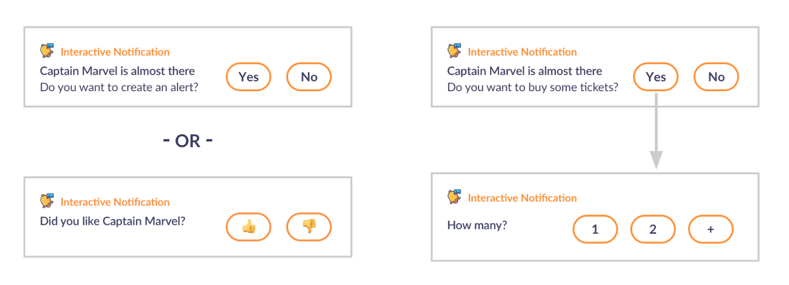

# interactive-notification (Android)

|                   	     | TYPE  	    | VERSION 	            | STATUS 	          | COVERAGE                |
|--------------------------- |:-------:	    |---------------------- |-------------------- |:-----------------------:|
| `demo`                     | _demo_  	    | ![Latest demo][v0]    | ![Build Status][s0] | ![Coverage Status][c0]  |
| `interactive-notification` | _library_  	| ![Latest version][v1] | ![Build Status][s1] | ![Coverage Status][c1]  |


Check: [VUI SDK](https://github.com/chattylabs/voice-user-interaction)

This is an implementation on top of the current Android Notification component that allows you to build a flow
of notifications and provides new customizable actions that can collect a rapid feedback from the user.



## Why choosing this library?

- No need to expand the notification to perform an action
- Action events work even when the device is locked
- Get a quick feedback by placing actions at right or at bottom
- Use either emojis or text for the action buttons
- You can customize the actions and message styles
- Add various actions with different sizes each
    
## Prerequisites
The SDK works on Android version 5.0 (Lollipop) and above. _(for lower versions [contact us](mailto:hello@chattylabs.com))_

## Dependencies

    repositories { 
        
        // Optional. Access to early versions not yet published.
        maven { url "https://dl.bintray.com/chattylabs/maven" }
    }

    dependencies {
        // Required
        implementation 'com.chattylabs.sdk.android:interactive-notification:<latest version>'
    }

## How to create a Notification flow?

The following is an example on how you can create a flow with 2 notifications.
<br/>You can apply configurations to the actions like sorting or resizing.

```kotlin
val component = InteractiveNotificationModule.provideComponent(...)
 
component.setReceiver(MyBroadcastReceiver::class.java)
 
with(component) {
    cancel()

    // Add a first Notification + Actions
    addNode(Message("message_id_1", "Any first random message question?"))
    addNode(Action("action_ok", "\uD83D\uDC4D", 0, 16f)) // 👍
    addNode(Action("action_ko", "\uD83D\uDC4E", 1, 16f)) // 👎

    // Add a second Notification + Actions
    addNode(Message("message_id_2", "Any second random message question?"))
    addNode(Action("action_yes", "Yes", 1, 16f))
    addNode(Action("action_no",  "No",  0, 16f))

    // Set the notification ID
    with(prepare(100)) { 

        // Build the flow
        from("message_id_1").to("action_ko", "action_ok")

        from("action_ok").to("message_id_2")

        // By default, if the user taps on "action_ko" (or any action without a relation)
        // the flow stops and the notification is dismissed

        from("message_id_2").to("action_yes", "action_no")
        
        // Start showing the first notification
        start(getNode("message_id_1"))
    }
}
```

&nbsp;

[v0]: https://img.shields.io/badge/demo-unplished-lightgrey.svg
[v1]: https://api.bintray.com/packages/chattylabs/maven/interactive-notification/images/download.svg?label=Latest%20version

[s0]: https://app.bitrise.io/app/4e16abe0098e0dcf/status.svg?token=B_KO07YfPteJ32E8avz6Lg&branch=master
[s1]: https://app.bitrise.io/app/4e16abe0098e0dcf/status.svg?token=B_KO07YfPteJ32E8avz6Lg&branch=master

[c0]: https://coveralls.io/repos/chattylabs/unknown/badge.svg?branch=master&service=github
[c1]: https://coveralls.io/repos/chattylabs/interactive-notification/badge.svg?branch=master&service=github
